# Agentic SDLC Ecosystem — Implementation Plan

**Nx Angular Monorepo + GitHub + Azure DevOps + Figma MCP + Teams/Outlook**

Build a greenfield Nx Angular monorepo wired into an end-to-end agentic development loop: Azure DevOps stories drive work, Copilot agents (local + cloud) plan/implement/review via MCP servers (GitHub, Azure DevOps, Figma, Microsoft 365), hybrid CI/CD validates and ships, and Teams/Outlook carry notifications — with enterprise governance throughout.

---

## Decisions

| Topic            | Decision                                                                   |
| ---------------- | -------------------------------------------------------------------------- |
| Deliverable      | Playbook docs + scaffolded working configs                                 |
| Monorepo tooling | Nx (Angular)                                                               |
| CI/CD            | Hybrid — GitHub Actions (PR validation) + Azure Pipelines (release/deploy) |
| Agent platform   | GitHub Copilot in VS Code (local) + Copilot coding agent (cloud)           |
| Starting point   | Greenfield — repo and ADO project are new                                  |

## Target Repository Layout

```
/
├── .github/
│   ├── copilot-instructions.md          # global agent instructions
│   ├── instructions/                    # scoped .instructions.md (angular, testing, scss, a11y)
│   ├── agents/                          # planner, implementer, reviewer, qa agent files
│   ├── prompts/                         # story-to-plan, figma-to-component, pr-summary, release-notes
│   ├── skills/                          # nx-generators, ado-workflow, design-tokens SKILL.md
│   ├── workflows/                       # ci.yml (nx affected), codeql.yml, copilot-setup-steps.yml
│   ├── CODEOWNERS
│   ├── pull_request_template.md         # includes AB# work-item link field
│   └── dependabot.yml
├── .vscode/mcp.json                     # GitHub, Azure DevOps, Figma, M365 MCP servers
├── pipelines/                           # Azure Pipelines release/deploy YAML
├── apps/                                # shell app
├── libs/                                # feature / ui / data-access / util libs
├── tools/                               # workspace generators & scripts
├── docs/sdlc-playbook/                  # the playbook documents
├── AGENTS.md
└── nx.json, package.json, eslint, prettier, commitlint, husky
```

---

## Phases

### Phase 1 — Monorepo Foundation

1. Scaffold Nx workspace (Angular preset, standalone components, latest Angular): `apps/shell` + example libs (`feature` / `ui` / `data-access` / `util`) with Nx module-boundary tags.
2. Tooling: ESLint + `@nx/enforce-module-boundaries`, Prettier, commitlint (Conventional Commits), husky hooks, `.editorconfig`, pinned Node version (`.nvmrc` / volta).
3. Repo governance: CODEOWNERS, PR template with AB# work-item link field, issue templates, branch strategy doc (trunk-based, short-lived branches named `feature/AB#<id>-desc`).

### Phase 2 — Agentic Layer (Copilot customization + MCP)

4. `.vscode/mcp.json` with servers:
   - **GitHub MCP** (remote: `https://api.githubcopilot.com/mcp/`)
   - **Azure DevOps MCP** (`@azure-devops/mcp`)
   - **Figma Dev Mode MCP** (desktop app local server) or Figma remote MCP
   - **Microsoft 365 MCP** (Teams/Outlook via Microsoft Graph)
   - Secrets via `${input:}` placeholders — never hardcoded.
5. `.github/copilot-instructions.md` — architecture rules, Nx conventions, commit/PR conventions, ADO traceability rules (always link AB#).
6. Scoped instruction files: `angular.instructions.md` (applyTo `**/*.ts`), `scss`, `testing` (Jest + Playwright), `accessibility`.
7. Custom agents:
   - `planner.agent.md` — reads ADO story → produces implementation plan
   - `implementer.agent.md` — writes code
   - `reviewer.agent.md` — read-only, advisory PR review
   - `qa.agent.md` — test authoring
   - Root `AGENTS.md` for cross-tool compatibility (cloud coding agent reads it).
8. Prompt files: `/story-to-plan` (fetch ADO work item → plan), `/figma-to-component` (Figma MCP → Angular component + tokens), `/pr-summary`, `/release-notes`.
9. Copilot coding agent (cloud): assign GitHub issues/ADO-synced items to Copilot; firewall/allowlist config; `.github/workflows/copilot-setup-steps.yml`.

### Phase 3 — Azure DevOps Integration

10. ADO project setup: Agile process, area/iteration paths, Feature → User Story → Task hierarchy, Definition of Ready/Done.
11. GitHub ↔ Azure Boards connection: Azure Boards GitHub app, AB# syntax linking commits/PRs to work items, auto state transitions (`Fix AB#123`).
12. Azure DevOps MCP server so local agents can query/update stories, create tasks, log status.

### Phase 4 — Hybrid CI/CD

13. GitHub Actions: `ci.yml` — `nx affected` lint/test/build on PR, Nx Cloud remote caching (optional), `codeql.yml`, `dependabot.yml`, secret scanning + push protection.
14. Azure Pipelines: release YAML — build artifacts, environments (dev/qa/prod) with approval gates, deploy target placeholder (Azure Static Web Apps / App Service), service connection via workload identity federation (no PATs).
15. Quality gates: coverage thresholds, bundle-size budgets, optional SonarQube/SonarCloud, required status checks + branch protection.

### Phase 5 — Design System + Figma

16. Figma MCP integration guide: Dev Mode MCP server (requires Figma desktop + Dev seat), `get_code` / `get_variable_defs` usage.
17. Design tokens pipeline: Figma variables → style-dictionary → SCSS/CSS custom properties in `libs/ui/tokens`.
18. Storybook for `libs/ui`; optional visual regression (Chromatic or Playwright screenshots).

### Phase 6 — Teams & Outlook Communication

19. Teams: GitHub for Teams app (PR/CI notifications), Azure Boards Teams app, Adaptive Card webhooks from pipelines (Teams Workflows).
20. Microsoft 365 MCP (Graph-based): mail summaries, meeting scheduling, standup digests. Document required Graph scopes + tenant admin consent.
21. Automated comms: release-notes digest posted to Teams channel; failed-pipeline alerts.

### Phase 7 — Enterprise Hardening & Governance

22. Security: CodeQL, Dependabot, secret scanning, SBOM generation, license compliance, OWASP dependency check, signed commits.
23. Identity/RBAC: GitHub teams ↔ Entra ID sync, ADO permissions model, least-privilege tokens, MCP secrets via env/Key Vault.
24. Agent governance: Copilot content exclusions, model/data-residency policy, human-in-the-loop rules — **agents never push to main; human PR review mandatory; reviewer agent is advisory only**.
25. Traceability chain: Story (ADO) → branch (`AB#id`) → PR (GitHub) → build → release → Teams notification. Audit via ADO + GitHub audit logs.
26. Observability: Application Insights placeholder in shell app; DORA metrics tracking.

### Phase 8 — Playbook Docs (`docs/sdlc-playbook/`)

27. `01-overview.md` (ecosystem mermaid diagram), `02-workflow.md` (agentic dev loop), `03-branching-and-traceability.md`, `04-agent-usage-guide.md`, `05-cicd.md`, `06-design-integration.md`, `07-communications.md`, `08-security-governance.md`, `09-onboarding-checklist.md`.

---

## The Agentic Development Loop

```mermaid
flowchart LR
    A[PO creates Story in ADO<br/>+ Figma link + DoR] --> B[Planner agent pulls story<br/>via ADO MCP → /story-to-plan]
    B --> C[Branch feature/AB#123-x<br/>Implementer agent codes<br/>Figma MCP for UI]
    C --> D[QA agent writes tests]
    D --> E[PR with AB# link<br/>Actions CI: nx affected]
    E --> F[Reviewer agent pre-review<br/>→ Human review → Merge]
    F --> G[Azure Pipeline release<br/>dev → qa → prod with approvals]
    G --> H[Teams/Outlook notifications<br/>ADO story auto-transitions]
```



1. PO creates Feature/Story in ADO (with Figma link, meets Definition of Ready).
2. Dev (or planner agent via ADO MCP) pulls the story → `/story-to-plan` → plan reviewed.
3. Branch `feature/AB#123-x`; implementer agent codes (Figma MCP for UI); QA agent writes tests.
4. PR with AB# link → GitHub Actions CI (`nx affected`) → reviewer agent pre-review → human review → merge.
5. Azure Pipeline releases through environments with approval gates.
6. Teams/Outlook notifications at PR, build, and release milestones; ADO story auto-transitions.

---

## Verification Checklist

- [ ] `npx nx run-many -t lint test build` passes; `nx graph` shows boundary tags
- [ ] Each MCP server surfaces tools in VS Code: list ADO work items, fetch GitHub repo, get Figma frame, send test Teams message
- [ ] Commit with `AB#<id>` → link appears on the ADO work item
- [ ] Draft PR triggers `nx affected` checks; commitlint rejects a non-conventional message
- [ ] Pipeline dry-run deploys to dev environment behind approval gate

## Open Considerations

1. **Deploy target** — not chosen. Recommend Azure Static Web Apps; alternatives: App Service / Front Door.
2. **Figma MCP flavor** — Dev Mode MCP needs Figma desktop + Dev/Full seats; remote MCP is the fallback.
3. **Microsoft 365 MCP server** — community server vs custom Graph MCP; requires tenant admin consent.
4. **Nx Cloud** — remote caching/distributed CI recommended but optional (subscription cost).
