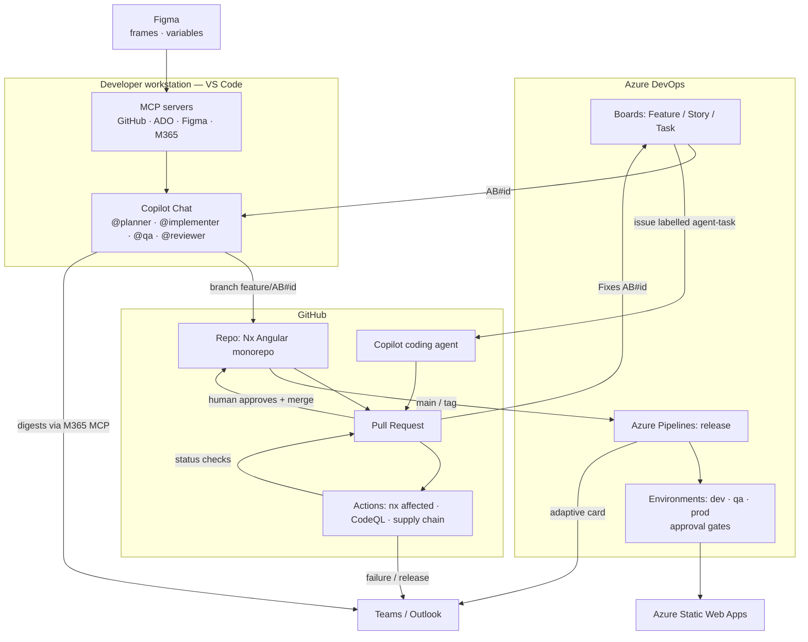

# 01 — Overview & Ecosystem

## Purpose

Deliver an Angular product from an Nx monorepo where **AI agents do the repetitive work** (planning, scaffolding, first-draft code, tests, reviews, release notes) and **humans keep every decision that matters** (acceptance criteria, merge, release). Every artefact is traceable from a business story to a running deployment.

## Systems of record

| Concern                  | System               | Owner role             | Integration point                                                    |
| ------------------------ | -------------------- | ---------------------- | -------------------------------------------------------------------- | ------- | ------------ | ------- |
| Work items (Epic→Task)   | Azure DevOps Boards  | Product Owner          | ADO MCP server; `AB#` linking; Azure Boards GitHub app               |
| Source, PRs, code review | GitHub               | Engineering            | GitHub MCP server; Actions; Copilot coding agent                     |
| PR validation            | GitHub Actions       | Platform               | `.github/workflows/ci.yml`                                           |
| Release & deploy         | Azure Pipelines      | Platform / Release mgr | `pipelines/azure-pipelines.yml`, ADO Environments with approvals     |
| Design                   | Figma                | Design                 | Figma MCP server; design tokens pipeline                             |
| Communication            | Teams, Outlook       | Everyone               | Microsoft 365 MCP; webhooks from CI/CD                               |
| Agent runtime (local)    | VS Code + Copilot    | Developer              | `.vscode/mcp.json`, `.github/agents                                  | prompts | instructions | skills` |
| Agent runtime (cloud)    | Copilot coding agent | Engineering            | `AGENTS.md`, `copilot-setup-steps.yml`, issues labelled `agent-task` |

## Ecosystem diagram



## Principles

1. **Human-in-the-loop at the gates.** Agents propose; people approve merges and releases. Reviewer agent output is advisory.
2. **Traceability is not optional.** No branch, commit, or PR without an `AB#<id>`. Enforced by commitlint, CI, and the PR template.
3. **Conventions are code.** Architecture rules live in lint (`@nx/enforce-module-boundaries`), not in wikis.
4. **Design is data.** Figma variables → tokens → CSS custom properties. No hardcoded design values.
5. **Least privilege everywhere.** No PATs in repo; MCP prompts for org names only; Azure via workload identity federation.
6. **Small batches.** PRs under ~400 lines, one story per PR, trunk-based.
7. **Build once, promote many.** The same artefact moves dev → qa → prod.

## Repository map

```
.github/
  copilot-instructions.md      global agent rules
  instructions/                scoped rules (angular, testing, styling)
  agents/                      planner · implementer · qa · reviewer
  prompts/                     /story-to-plan · /figma-to-component · /pr-summary · /release-notes
  skills/                      nx-generators · ado-workflow · design-tokens
  workflows/                   ci · codeql · supply-chain · notify-teams · copilot-setup-steps
  CODEOWNERS · pull_request_template.md · ISSUE_TEMPLATE/ · dependabot.yml
.vscode/mcp.json               MCP servers (no secrets)
pipelines/                     Azure Pipelines release + templates
apps/agentic-monorepo-main     shell app (+ -e2e)
libs/dashboard/{feature,ui,data-access}
libs/shared/{ui,util,ui-tokens}
docs/sdlc-playbook/            this playbook
AGENTS.md                      rules for autonomous coding agents
commitlint.config.mjs · .husky/  commit hygiene
```
