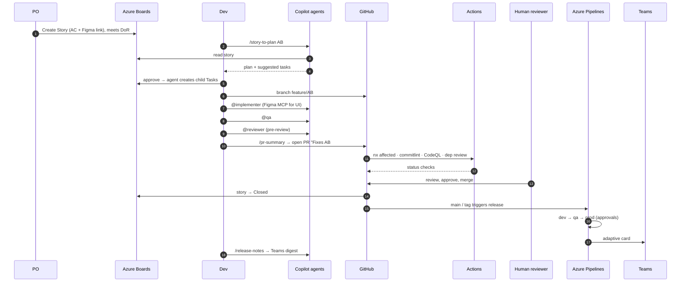

# 02 — The Agentic Development Loop

One story, end to end. Roles: **PO** (Product Owner), **Dev**, **Reviewer** (a second human), **Release manager**. Agents in `code font`.



## Step by step

### 1. Story is ready (PO)

- Create the User Story in Azure Boards under a Feature.
- Acceptance criteria are written as testable statements.
- Attach the Figma frame link if UI is involved.
- Story is in the current iteration and sized. → meets **Definition of Ready** (see [ado-workflow skill](../../.github/skills/ado-workflow/SKILL.md)).

### 2. Plan (Dev + `@planner`)

```
/story-to-plan   → work item: 123
```

The planner fetches the story, quotes the AC, inspects Figma if linked, explores the workspace, and outputs a plan with affected projects, generator commands, tests, missing tokens, risks, and a branch name. It offers to create child Tasks in ADO. **Review the plan** — you are accountable for it, not the agent.

### 3. Branch

```
git switch -c feature/AB#123-kpi-summary-card
```

### 4. Implement (Dev + `@implementer`)

- For UI from Figma: `/figma-to-component` with the frame URL, target lib, and component name.
- For everything else: `@implementer` with the approved plan.
- The agent scaffolds with Nx generators, follows Angular/styling/testing rules, adds tokens if Figma variables are missing, and runs `nx affected` before finishing.
- **You** read every diff. Push back on anything you don't understand.

### 5. Test (Dev + `@qa`)

`@qa` maps each acceptance criterion to a test, writes unit + e2e specs, and reports a traceability table. Criteria that can't be automated go into the PR checklist as manual steps.

### 6. Pre-review (`@reviewer`)

Run `@reviewer` on the branch. Fix blocking findings; justify anything you leave. Paste its verdict into the PR under "Agent involvement".

### 7. Commit & PR

Commit with Conventional Commits + `AB#123` footer (husky/commitlint enforce it). Then:

```
/pr-summary
```

opens a draft PR with the template fully filled, including `Fixes AB#123`. Mark ready for review.

### 8. CI (GitHub Actions)

`ci.yml` runs commitlint on the PR range, `nx format:check`, `nx affected -t lint test build` (ci config with coverage thresholds), affected e2e, and PR hygiene (AB# present, size warning). `codeql.yml` and `supply-chain.yml` run in parallel. All are required status checks.

### 9. Human review & merge

A **different human** reviews. Squash-merge is recommended (keeps one Conventional Commit per story on `main`). On merge, the Azure Boards integration moves the story to Closed.

### 10. Release (Azure Pipelines)

Every merge to `main` builds once and deploys to **dev**, then **qa**. Tag `vX.Y.Z` promotes the same artefact to **prod** after the environment approval. Teams gets an adaptive card per run.

### 11. Communicate

`/release-notes vX.Y.Z` groups merged stories by Feature, drafts notes, and (with your OK) posts to Teams / creates a GitHub Release.

## Cloud variant: Copilot coding agent

For well-scoped, low-risk tasks (a11y fixes, test gaps, token additions, small components):

1. Create a GitHub issue with the **Agent task** template (includes `AB#`, scope, AC).
2. Assign it to **Copilot**. It reads `AGENTS.md`, runs `copilot-setup-steps.yml`, works in an isolated branch, and opens a PR.
3. The same CI and human-review gates apply. The agent cannot merge.

## Timeboxes & escalation

- If the planner asks clarification questions, stop and get answers from the PO — don't guess.
- If `@implementer` can't make `nx affected` green in two attempts, review manually; don't let it thrash.
- If a PR exceeds ~400 lines, split it before requesting review.
