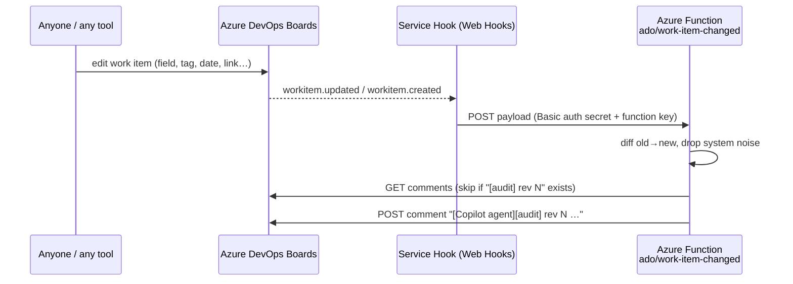

# ado-audit-hook

Azure Function that guarantees **every change to an Azure DevOps work item gets a change-log comment** — regardless of who made the change or where (web UI, Boards mobile, MCP agent, REST, GitHub integration).

It is the always-on counterpart of the `@ado-auditor` chat agent: the agent audits on demand from VS Code; this function audits automatically via an ADO **Service Hook**.



## What the comment looks like

```
[Copilot agent][audit] rev 4 — State + Tags changed

**Changed by:** mudit bajpai · **When:** 2026-09-16 09:12:44 UTC

| Field         | Before | After          |
| ------------- | ------ | -------------- |
| State         | To Do  | Doing          |
| Tags (added)  | —      | mcp; phase-1   |
| Target Date   | —      | 2026-10-07     |
| Link added    | —      | Child → #12    |

_Summary:_ State: To Do → Doing; Tags (added): — → mcp; phase-1; Target Date: — → 2026-10-07; Link added: — → Child → #12.

_Posted automatically by the ado-audit-hook Azure Function._
```

Behaviour rules (same as the `@ado-auditor` agent):

- Every user-visible field counts — tags, dates, iteration, area, priority, assignee, state, title, story points, custom fields, links, attachments.
- Ignored: `System.Rev`, `ChangedDate/By`, `Watermark`, `CommentCount`, `StateChangeDate` and similar system-only fields (`src/lib/field-names.ts`).
- Long rich-text fields (Description, Acceptance Criteria, Repro Steps) are summarised by word count, never quoted.
- One comment per revision; if `[audit] rev N` already exists it is skipped (idempotent, safe for ADO retries).
- A revision with only system-field changes produces **no** comment — this is also what stops the function's own comment from triggering another audit.
- Comments only. The function never edits fields.

## Project layout

```
tools/ado-audit-hook/
├── host.json                      Functions host config
├── local.settings.json.example    copy to local.settings.json (git-ignored)
├── package.json                   deploy manifest (main → dist/src/functions/*.js)
├── src/functions/work-item-changed.ts   HTTP trigger: auth → parse → handleEvent
└── src/lib/
    ├── types.ts          Service Hook payload types
    ├── field-names.ts    ignore list, friendly names, relation names
    ├── diff.ts           old/new → table rows (tags, dates, identities, links, long text)
    ├── comment.ts        markdown renderer + "[audit] rev N" marker
    ├── ado-client.ts     Comments REST API (list / add) with PAT
    ├── handle-event.ts   orchestration + idempotency
    └── auth.ts           Basic-auth secret check (timing-safe)
```

Nx targets: `npx nx run tools-ado-audit-hook:{build,test,lint,serve}`.

## Configuration (app settings)

| Setting          | Value                                                                                                |
| ---------------- | ---------------------------------------------------------------------------------------------------- |
| `ADO_ORG_URL`    | `https://dev.azure.com/mbajpai0112`                                                                  |
| `ADO_PAT`        | PAT with **Work Items: Read & write** (only scope needed). Store as a Key Vault reference in Azure.  |
| `WEBHOOK_SECRET` | Random string (e.g. `openssl rand -hex 32`). Must match the Basic-auth password on the service hook. |

> The org is backed by a personal Microsoft account, so Managed Identity / Entra tokens cannot be used against it (AADSTS500200). A PAT is the only option; rotate it and keep it in Key Vault.

## Run locally

Prerequisites: Node 20+, [Azure Functions Core Tools v4](https://learn.microsoft.com/azure/azure-functions/functions-run-local) (`func`), and Azurite or a storage account for `AzureWebJobsStorage`.

```bash
cp tools/ado-audit-hook/local.settings.json.example tools/ado-audit-hook/local.settings.json
# fill in ADO_PAT and WEBHOOK_SECRET
npx nx run tools-ado-audit-hook:serve
```

The endpoint is `http://localhost:7071/api/ado/work-item-changed`. To receive real events locally, expose it with a tunnel (e.g. `devtunnel host -p 7071` or ngrok) and point the service hook at the tunnel URL.

Smoke test without ADO:

```powershell
$body = Get-Content tools/ado-audit-hook/sample-payload.json -Raw   # any workitem.updated payload
$auth = "Basic " + [Convert]::ToBase64String([Text.Encoding]::UTF8.GetBytes("ado:<WEBHOOK_SECRET>"))
Invoke-RestMethod -Method Post -Uri http://localhost:7071/api/ado/work-item-changed -Headers @{ Authorization = $auth } -ContentType application/json -Body $body
```

## Deploy to Azure

1. Create a Function App: **Node 20 LTS**, **Consumption** plan (Linux or Windows), Functions runtime **~4**.
2. Add the three app settings above (`ADO_PAT` ideally as `@Microsoft.KeyVault(SecretUri=…)`).
3. Build and publish:

   ```bash
   npx nx run tools-ado-audit-hook:build
   cd tools/ado-audit-hook
   npm ci --omit=dev
   func azure functionapp publish <function-app-name>
   ```

4. Copy the function URL: **Function App → Functions → work-item-changed → Get function URL** (includes `?code=<function key>`).

## Wire up the Azure DevOps Service Hook

Repeat once for **Work item created** and once for **Work item updated** (Project Settings → Service hooks → **+**):

| Step                         | Value                                                                                                          |
| ---------------------------- | -------------------------------------------------------------------------------------------------------------- |
| Service                      | **Web Hooks**                                                                                                  |
| Trigger                      | `Work item created` / `Work item updated`                                                                      |
| Filters                      | Area path: `[Any]`; Work item type: `[Any]` (Epic, Feature, User Story, Task, Bug all covered); Field: `[Any]` |
| URL                          | the function URL from step 4 (with `?code=…`)                                                                  |
| Basic auth                   | username: `ado`, password: the `WEBHOOK_SECRET`                                                                |
| Resource details to send     | **All** (required — this is where `fields.oldValue/newValue` live)                                             |
| Messages / Detailed messages | **None**                                                                                                       |

Click **Test** — ADO sends a sample payload; expect HTTP `200` (`posted`) or `202` (`skipped`) in the response. Then **Finish**.

Two layers of protection guard the endpoint: the function key in the URL (Azure) and the shared secret in the Basic-auth header (this code). A request missing either is rejected.

## Response codes

| Code | Meaning                                                                      |
| ---- | ---------------------------------------------------------------------------- |
| 200  | Audit comment posted                                                         |
| 202  | Skipped — already audited, no user-visible change, or unsupported event type |
| 400  | Body is not a service-hook payload                                           |
| 401  | Missing/invalid `WEBHOOK_SECRET`                                             |
| 500  | ADO REST call failed or settings missing — ADO will retry the delivery       |

## Relationship to `@ado-auditor`

| Scenario                                     | Who handles it                                               |
| -------------------------------------------- | ------------------------------------------------------------ |
| Any edit, any source, going forward          | this function (automatic)                                    |
| Historical revisions before the hook existed | `@ado-auditor AB#<id> --backfill` in VS Code                 |
| Function was down / delivery failed          | ADO retries; otherwise `@ado-auditor AB#<id> --since <date>` |

Both use the same `[Copilot agent][audit] rev N` marker, so they never double-post on the same revision.
